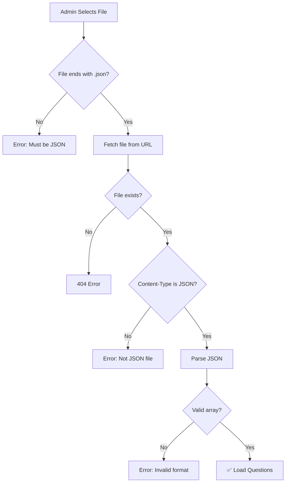

# ✅ Fixed: Chemistry Files এবং Loading Errors

## যে Problems ছিল

### Problem 1: Chemistry Files Save হচ্ছিল না
**Error**: `{"error":"Invalid question file format"}`

**Root Cause**: 
- Validation শুধু `questions.json` এবং `questions-*.json` allow করত
- `Chemistry6.json` এর মত files reject হয়ে যেত

### Problem 2: Exam Page এ HTML Error
**Error**: `Unexpected token '<', "<!DOCTYPE "... is not valid JSON`

**Root Cause**:
- File load fail হলে Vercel 404/error HTML page return করে
- ExamPage সেই HTML টা JSON হিসেবে parse করার চেষ্টা করে
- Parse error হয়

## যে Fixes করেছি

### ✅ Fix 1: Validation Relaxed
**File**: `api/set-active-question-file.js`

```javascript
// আগে (শুধু questions*.json)
if (fileName !== 'questions.json' && !/^questions-.+\.json$/.test(fileName)) {
    return res.status(400).json({ error: 'Invalid question file format' })
}

// এখন (যেকোনো .json file)
if (!fileName.endsWith('.json')) {
    return res.status(400).json({ error: 'File must be a JSON file' })
}
```

**Result**: এখন Chemistry, Physics বা যেকোনো JSON file select করা যাবে!

### ✅ Fix 2: Better Error Handling
**File**: `src/pages/ExamPage.jsx`

**Added**:
1. **Cache Busting**: File URL এ `?t=timestamp` যোগ করা
2. **Content-Type Check**: Response JSON কিনা verify করা
3. **Better Error Messages**: User কে exact problem দেখানো

```javascript
// Cache buster
const cacheBuster = `?t=${Date.now()}`
const fileUrl = `/${file}${cacheBuster}`

// Content type validation
const contentType = res.headers.get('content-type')
if (!contentType || !contentType.includes('application/json')) {
    throw new Error(`File ${file} is not a JSON file`)
}
```

## এখন যা করতে হবে

```bash
git push origin main
```

Vercel deploy হওয়ার পর (1-2 minutes):

1. ✅ **Chemistry Files Save হবে**
2. ✅ **Clear Error Messages দেখাবে**  
3. ✅ **Automatic cache refresh হবে**

## Test করুন

### Admin Panel Test
1. Settings modal open করুন
2. Chemistry6.json select করুন
3. Save click করুন
4. ✅ Success notification দেখাবে!

### Exam Page Test
1. Exam page এ যান
2. Browser console check করুন (F12)
3. দেখবেন: `Loading questions from /Chemistry6.json?t=...`
4. ✅ Questions properly load হবে!

## যদি এখনো Error দেখায়

### Check Console Logs
Browser console এ দেখুন:
- File URL কি correct?
- Content-Type কি `application/json`?
- Response status কি 200?

### Common Issues

**যদি 404 error**:
- File টা আসলেই `public/` folder এ আছে কিনা check করুন
- File name spelling ঠিক আছে কিনা verify করুন

**যদি JSON parse error**:
- File এর content valid JSON কিনা check করুন
- Online JSON validator এ paste করে test করুন

**যদি empty questions array**:
- File এ questions আছে কিনা check করুন
- File format ঠিক আছে কিনা verify করুন (array of objects)

## Logic Summary



এখন **যেকোনো JSON file** work করবে: Chemistry, Physics, Math - যা খুশি!
